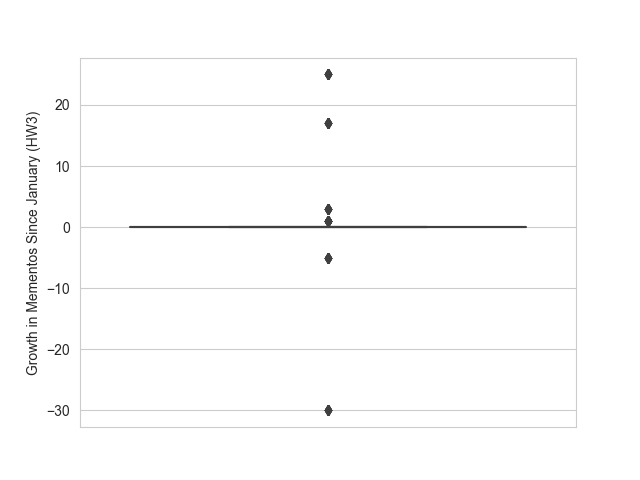

# Homework 9 - Revisiting Web Archiving, Part 3
**Due:** Sunday, December 8, 2024 by 11:59pm  

## Assignment

Write a report that contains the answers and *explains how you arrived at the answers* to the following questions.  Be sure to address any questions that are asked (indicated by "*Q: ...?*" in italics). Include any interesting findings that you discover from your analysis.  

Before starting, review the [HW report guidelines](getting-started/reports.md).  Name your report for this assignment `HW9-report` with the proper file extension.  

**Important:** This assignment requires the use of URIs collected in HW1, webpage content collected in HW2, and TimeMaps collected in HW3. If you did not complete HW1-HW3 satisfactorily, contact me for instructions on how to proceed. *This cannot be done at the last minute.*

**Note about Programming Tasks:** For several of the programming tasks this semester, you will be asked to write code to operate on 100s or 1000s of data elements.  If you have not done this type of development before, I *strongly encourage* you to start small and work your way up.  Especially when you are using new tools or APIs, start on a small test dataset to make sure you understand how to use the tool and that your processing scripts are working before ramping up to the full set. *This will save you an enormous amount of time.*

### Q1. Get TimeMaps for Each URI (again)

Re-download the 500 TimeMaps from Q1 in [HW3](HW3-archive.md).  About 2 months have passed since you first collected these TimeMaps, so it's likely that things have changed (pages could have been archived more since then, or the state of the web archives could have changed).  

Remember that you must run a local instance of MemGator and that you must use the modified `archives.json` file. See the [HW3 instructions](HW3-archive.md) for a reminder on how to set this up.

We want to see how the size of the 500 TimeMaps have changed.  To do this, you will calculate the difference between the number of mementos (URI-Ms) in each TimeMap for the HW3 ones and the new ones. Calculate the difference such that:

* if a TimeMap has "shrunk" (has fewer mementos now than it did in HW3), it will have a negative value
* if it has stayed the same, it will have a "0" value
* if it has grown (has more mementos now than it did in HW3), the value will be positive. 

Use Seaborn's [`boxplot()`](https://seaborn.pydata.org/generated/seaborn.boxplot.html) function to graph a boxplot of the differences. Example is below:

As always, upload all the TimeMap data to your GitHub repo.

### Q2. Get Content for Each URI (again)

Repeat Q1 from [HW2](HW2-search.md) to re-download the HTML of each webpage and remove the boilerplate.   As in HW2, keep both files for each URI (i.e., raw HTML and processed), and upload both sets of files to your GitHub repo. Put the raw and processed files in separate folders.

*Q: Do all 500 URIs still return a "200 OK" as their final response (i.e., at the end of possible redirects)?*

### Q3. Compare Webpage Size Differences

For each webpage, compare the size of resulting text from HW2 to the text you have now. 

Create two boxplots similar to that from Q1, except now the data corresponds to difference in bytes (and not difference in TimeMap magnitudes).  For the first graph, use the difference in the raw HTML sizes.  For the second graph, use the difference in the processed results.

### Q4. Explore Webpage Differences

Of the URIs that still terminate in a "200 OK" response, pick the 3 that have changed the most (based on the processed text). Use the Unix `diff` command or another text difference tool to explore the differences in the version pairs.  What things have changed?

## Submission

You should be working in the private GitHub repo that I created for you in the [odu-cs432-websci organization](https://github.com/odu-cs432-websci/) (your repo URL should look something like https<nolink>://github.com/odu-cs432-websci/fall24-*username*/). 

If you are working locally, make sure that you have committed and pushed your local repo, including `HW9-report.md` and any images you reference, to GitHub. 

Submit the URL of your report (*not the URL of your repo*) in Canvas under HW9. This should be something like  
https<nolink>://github.com/odu-cs432-websci/fall24-*username*/blob/main/HW9-report.md

*If you make changes to your report after submitting in Canvas, I will use the last commit time in your repo as your assignment submission time.*
